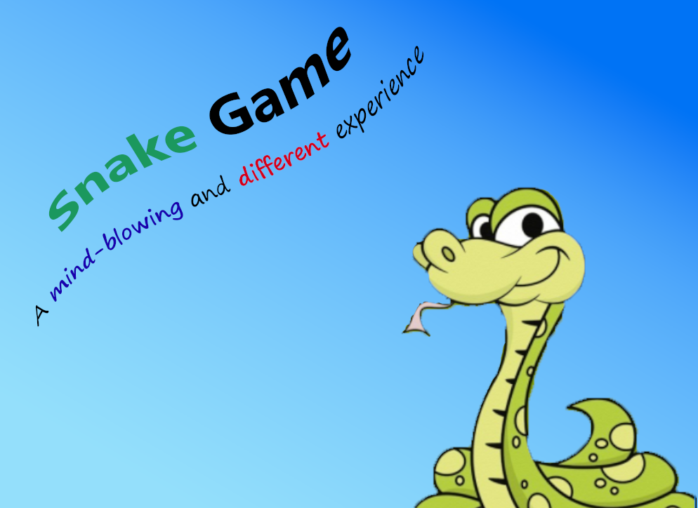
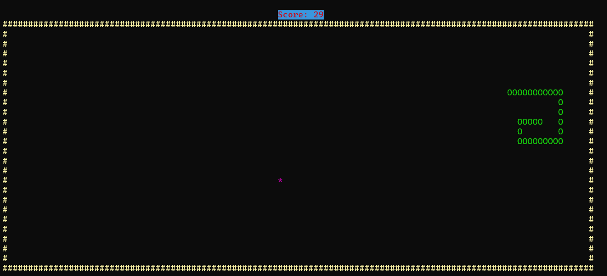

# Snake Game



*Snake Game* is a Terminal-based game which tries to simulate the game in real world.

You have to eat as many fruits **(shown as stars)** as possible in the game. The more you eat fruit, the more the score you gain.


  

## Features

- A terminal-based interface with a gameplay screen.

- The ability to control the snake’s movement using keyboard inputs.

- A basic game loop with frame updates.

- Player speed and game frame rate adjusted for smoother gameplay with no image jumping.

## How to Build and Run

To build and run this project, you need to have `mingw-w64` and `make` installed on your computer.

You can follow how to install `mingw-w64` through the guide provided for Visual Studio Code in this [link](https://code.visualstudio.com/docs/cpp/config-mingw#_installing-the-mingww64-toolchain).

Here's how to install `make` on your computer:

 ### Microsoft Windows
1. Download and install MSYS2 from [official website](https://www.msys2.org).

2. Open MSYS2 terminal (MSYS MinGW 64-bit or MSYS2 MinGW 32-bit).

3. Update the package manager:

```bash
pacman -Syu
```

4. Install **make**

- For 64-bit:


```bash
 pacman -S mingw-w64-x86_64-make
```

- For 32-bit:

```bash
pacman -S mingw-w64-i686-make
```
5. Install `make` through the following command:
   
```bash
pacman -S make
```

6. Check the installation:

```bash
make --version
```

7. Now in the project directory, simply execute:

```bash
make
```

## How to Execute

Enter the `build` folder after building the project and run `snake.exe`.

**This application is currenly compatible with Windows. Make sure you run this program through Command Prompt.**

## Contribution

You can submit your issues in the [issues](https://github.com/mahdikarami8484/SnakeGame/issues) section. You can talk about any bugs, invalid result and improvements about this project.

Moreover, you can send us a [pull request](https://github.com/mahdikarami8484/SnakeGame/pulls) if you'd like to contribute to project. We're open to any useful tips and suggestions. :)
